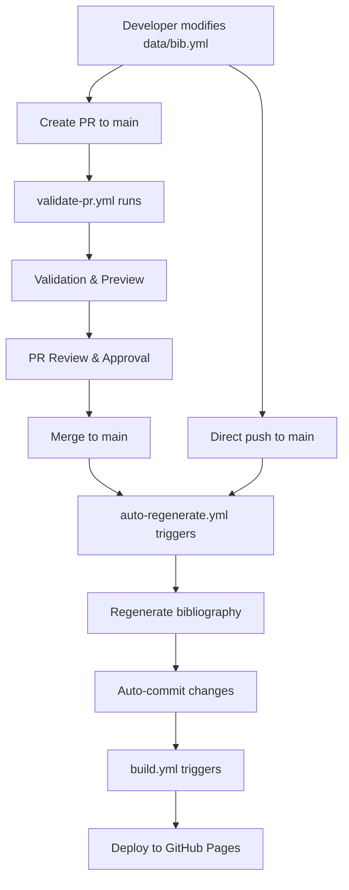

# GitHub Actions Workflows

This directory contains the automated workflows for the Agentic AI Bibliography project.

## Workflows Overview

### 1. `auto-regenerate.yml` - Auto-Regenerate Bibliography

**Trigger:** Push to `main` branch when `data/bib.yml` is modified

**Purpose:** Automatically regenerates bibliography markdown files when  
bibliography data changes

**Process:**

1. Detects changes to `data/bib.yml`
2. Runs consistency checks
3. Regenerates all bibliography markdown files
4. Validates generated files with markdownlint
5. Auto-commits and pushes changes (with `[skip ci]` to prevent loops)

**Features:**

- Skips execution if commit message contains `[skip ci]`
- Provides detailed summary of changes
- Ensures all generated files pass markdownlint validation

### 2. `validate-pr.yml` - Validate Bibliography Changes

**Trigger:** Pull requests targeting `main` branch with changes to  
`data/bib.yml` or `data/toc.yml`

**Purpose:** Validates proposed changes before they are merged

**Process:**

1. Validates YAML syntax
2. Runs consistency checks
3. Tests bibliography generation
4. Validates generated markdown with markdownlint
5. Checks for required fields and duplicate IDs
6. Uploads preview artifacts

**Features:**

- Comprehensive validation suite
- Preview generation for reviewers
- Detailed PR summary with validation results

### 3. `build.yml` - Build and Deploy Bibliography

**Trigger:**

- Push to `main` branch (for deployment)
- Pull requests (for validation)
- Manual dispatch

**Purpose:** Main build and deployment workflow

**Process:**

1. Validates existing bibliography files
2. Runs full consistency checks
3. Validates markdownlint compliance
4. Deploys to GitHub Pages (main branch only)
5. Uploads artifacts

**Features:**

- GitHub Pages deployment
- Full validation suite
- Artifact generation

## Workflow Interactions

## Workflow Flow

### **🔄 Flujo de Trabajo Automatizado:**

**Flujo Recomendado (con Pull Request):**

1. Desarrollador modifica `data/bib.yml` en feature branch
2. Crea Pull Request hacia main
3. `validate-pr.yml` valida cambios y genera preview
4. Revisión y aprobación del PR
5. Merge a main branch
6. `auto-regenerate.yml` se activa automáticamente
7. Regenera archivos de bibliografía
8. Auto-commit de cambios generados
9. `build.yml` despliega a GitHub Pages

**Flujo Directo (push a main):**

1. Desarrollador modifica `data/bib.yml`
2. Push directo a main branch
3. `auto-regenerate.yml` se activa inmediatamente
4. Regenera y auto-commit de archivos
5. `build.yml` despliega a GitHub Pages

## Configuration Files

- `.markdownlint.json` - Markdownlint configuration for consistent formatting
- `requirements.txt` - Python dependencies for all workflows

## Markdownlint Validation

All workflows ensure that generated markdown files comply with markdownlint rules:

- **MD013**: Line length limit (80 characters)
- **MD022**: Proper spacing around headings
- **MD032**: Proper spacing around lists
- **MD034**: No bare URLs (use angle brackets)
- **MD012**: No multiple consecutive blank lines
- **MD051**: Valid link fragments

## Security Considerations

- Uses `GITHUB_TOKEN` for authentication
- Auto-commits include `[skip ci]` to prevent infinite loops
- Workflows only trigger on specific file paths to optimize performance
- Artifacts have limited retention periods

## Troubleshooting

### Common Issues

1. **Auto-regeneration not working:**
   - Check if commit message contains `[skip ci]`
   - Verify `data/bib.yml` syntax is valid
   - Check workflow logs for errors

2. **Markdownlint validation failing:**
   - Review generated files for formatting issues
   - Check `.markdownlint.json` configuration
   - Ensure text wrapping and spacing are correct

3. **Deployment not working:**
   - Verify push is to `main` branch
   - Check GitHub Pages settings
   - Review build logs for errors

### Manual Workflow Execution

All workflows support manual dispatch for testing and troubleshooting:

1. Go to repository Actions tab
2. Select desired workflow
3. Click "Run workflow"
4. Choose branch and trigger manually
